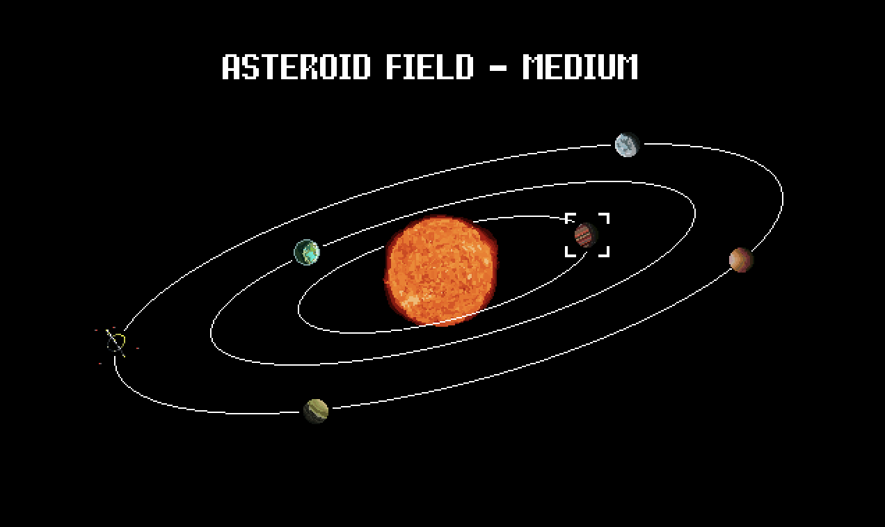

# LD44

   

    

Slave Odyssey is a shoot 'em up made in 72 hours for the LD44 game jam ([project page](https://ldjam.com/events/ludum-dare/44/slave-odyssey)).

The theme was "your life is currency" : the only way to upgrade your ship in the game is to trade crew members.

This game has 3 possible endings.

## The team

- [A_Do](https://www.twitter.com/Adorikill) : pixel art
- [Le Art](https://www.twitter.com/LeArtRemix) : music
- [Pokiharena](https://www.github.com/Pokiharena) : code
- LuGrandcheveu : level design
- Djulo : narration
- [yopox](https://www.github.com/elyopox) : code

## Credits

Thanks [Eeve Somepx](https://www.twitter.com/somepx) for the EquipmentPro pixel font !